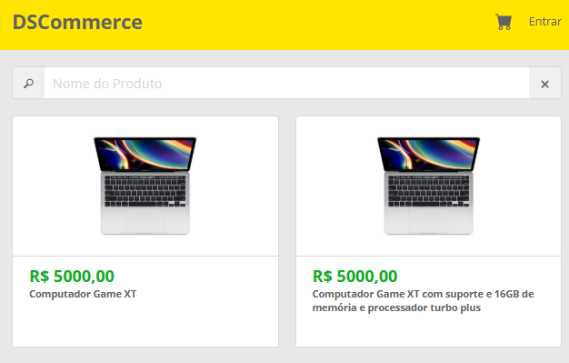
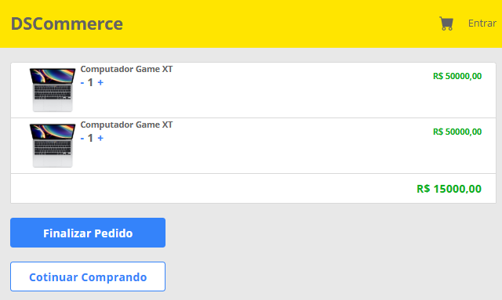
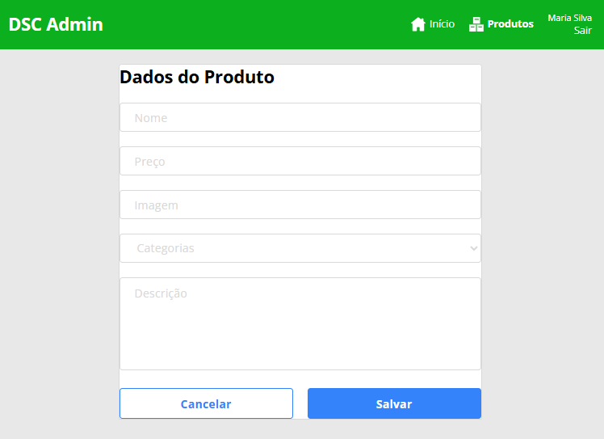

# 🛒 DSCommerce - Layout HTML e CSS

Projeto desenvolvido durante o curso **ReactJS Professional** da **DevSuperior**, com foco na construção do layout de um e-commerce utilizando **HTML5** e **CSS3**, seguindo fielmente o design disponibilizado no Figma.

O objetivo deste projeto foi desenvolver toda a interface antes da integração com React, simulando uma etapa comum no desenvolvimento Front-end profissional.

---

# 📚 Objetivos

Neste projeto foram praticados conceitos como:

- Estruturação de páginas utilizando HTML5 semântico;
- Organização e reutilização de estilos com CSS3;
- Componentização do layout;
- Responsividade para diferentes resoluções;
- Organização de arquivos;
- Preparação da interface para futura integração com React.

---

# 🚀 Tecnologias Utilizadas

- HTML5
- CSS3
- Flexbox
- CSS Grid
- Responsividade

---

# 📂 Estrutura do Projeto

```text
DSCommerce/
│
├── css/
├── img/
├── Admin-Home.html
├── Carrinho.html
├── Catalogo.html
├── Confirmacao.html
├── Detalhe.html
├── Form.html
├── Listagem.html
├── Login.html
└── README.md
```

---

# 📷 Telas do Sistema

## 🔑 Login


---

## 🛍️ Catálogo de Produtos



---

## 📄 Detalhes do Produto


---

## 🛒 Carrinho



---

## ✅ Confirmação do Pedido


---

## 🛠️ Área Administrativa

### Página Inicial


---

### Listagem de Produtos


---

### Cadastro de Produto



---

# 🎯 Funcionalidades

### Área Pública

- Login
- Catálogo de Produtos
- Pesquisa de produtos
- Página de detalhes
- Carrinho de compras
- Confirmação do pedido

### Área Administrativa

- Dashboard administrativo
- Listagem de produtos
- Cadastro de produtos
- Estrutura preparada para edição e exclusão

---

# 📖 Sobre o Projeto

Este projeto representa a etapa de construção do layout de uma aplicação de e-commerce.

O desenvolvimento foi realizado seguindo o fluxo utilizado em aplicações modernas:

```text
Figma
      ↓
HTML + CSS
      ↓
React
      ↓
Integração com API
```

O foco foi reproduzir fielmente o design proposto e preparar a interface para a implementação da lógica de negócio utilizando React.

---

# ▶️ Como Executar

Clone o repositório:

```bash
git clone https://github.com/LuizHSDias/Ecommerce.git
```

Entre na pasta do projeto:

```bash
cd Ecommerce
```

Abra qualquer página HTML em seu navegador.

Exemplo:

```text
Catalogo.html
```

ou

```text
Login.html
```

---

# 👨‍💻 Autor

**Luiz Henrique Santos Dias**

Curso ReactJS Professional — DevSuperior

---