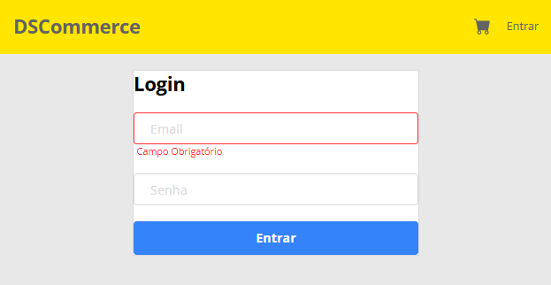
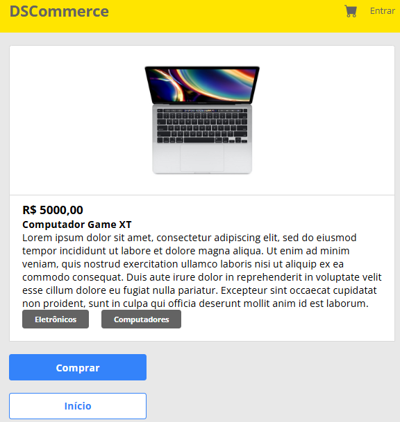
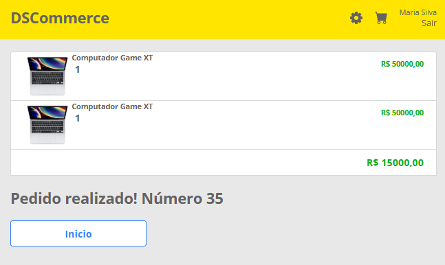
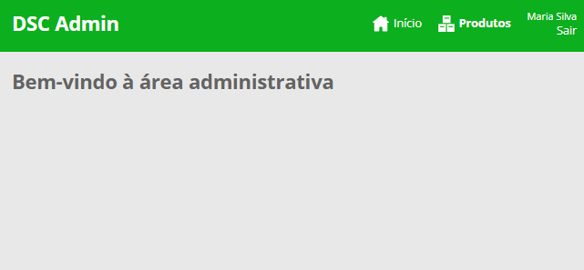
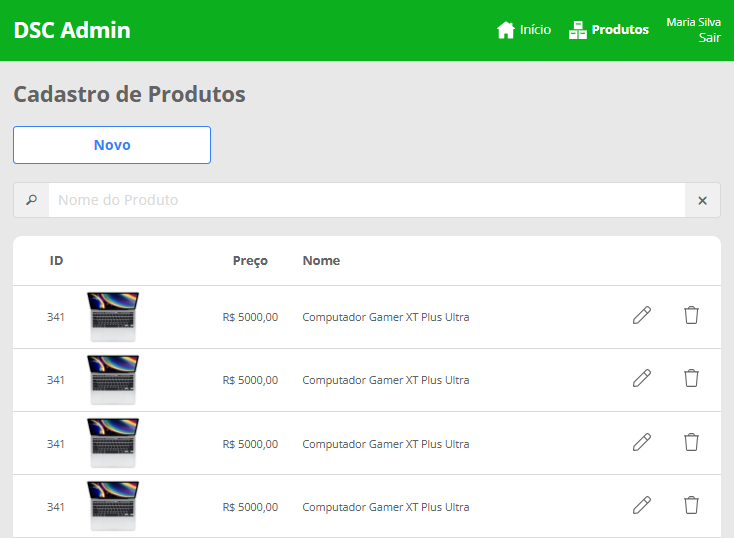

# 🛒 DSCommerce - Layout HTML e CSS

Projeto desenvolvido durante o curso **ReactJS Professional** da **DevSuperior**, com foco na construção do layout de um e-commerce utilizando **HTML5** e **CSS3**, seguindo fielmente o design disponibilizado no **Figma**.

O objetivo deste projeto foi desenvolver toda a interface antes da integração com React, simulando uma etapa comum no desenvolvimento Front-end profissional.

---

# 📚 Objetivos

Neste projeto foram praticados conceitos como:

- Estruturação de páginas utilizando HTML5 semântico;
- Organização e reutilização de estilos com CSS3;
- Componentização do layout;
- Responsividade para diferentes tamanhos de tela;
- Organização de arquivos do projeto;
- Preparação da interface para futura integração com React.

---

# 🚀 Tecnologias Utilizadas

- HTML5
- CSS3
- Flexbox
- CSS Grid
- Responsividade

---

# 📂 Estrutura do Projeto

```text
DSCommerce/
│
├── css/                      # Arquivos de estilo
├── img/                      # Imagens da aplicação e capturas de tela
├── Admin-Home.html
├── Carrinho.html
├── Catalogo.html
├── Confirmacao.html
├── Detalhe.html
├── Form.html
├── Listagem.html
├── Login.html
└── README.md
```

---

# 📷 Telas do Sistema

## Área Pública

<p align="center">
  
  
</p>

<p align="center">
  
  
</p>

<p align="center">
  
</p>

---

## Área Administrativa

<p align="center">
  
  
</p>

<p align="center">
  
</p>

---

# 🎯 Funcionalidades

## Área Pública

- Login de usuários;
- Catálogo de produtos;
- Pesquisa de produtos;
- Página de detalhes;
- Carrinho de compras;
- Confirmação de pedido.

## Área Administrativa

- Dashboard administrativo;
- Listagem de produtos;
- Cadastro de produtos;
- Estrutura preparada para edição e exclusão de produtos.

---

# 📖 Sobre o Projeto

Este projeto representa a etapa de construção do layout de uma aplicação de e-commerce.

O desenvolvimento foi realizado seguindo um fluxo comum em aplicações Front-end modernas:

```text
Figma
   │
   ▼
HTML + CSS
   │
   ▼
React
   │
   ▼
Integração com API
```

O foco foi reproduzir fielmente o layout proposto e preparar toda a interface para uma futura implementação da lógica utilizando React.

---

# ▶️ Como Executar

## 1. Clone o repositório

```bash
git clone https://github.com/LuizHSDias/Ecommerce.git
```

## 2. Acesse a pasta do projeto

```bash
cd Ecommerce
```

## 3. Abra qualquer página HTML no navegador

Exemplos:

```text
Catalogo.html
```

ou

```text
Login.html
```

Não é necessária nenhuma instalação de dependências, pois o projeto utiliza apenas HTML e CSS.

---

# 📖 Aprendizados

Durante o desenvolvimento deste projeto foram aplicados conceitos importantes de desenvolvimento Front-end, como:

- HTML semântico;
- CSS Flexbox;
- CSS Grid;
- Responsividade;
- Organização de componentes visuais;
- Estruturação de interfaces baseadas em protótipos do Figma.

---

# 👨‍💻 Autor

**Luiz Henrique Santos Dias**

Projeto desenvolvido durante o curso **ReactJS Professional** da **DevSuperior**.

---